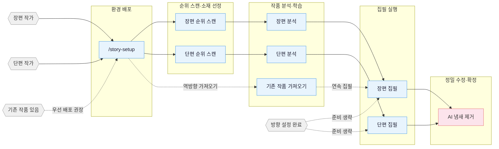

[English](README_EN.md) | **한국어**

# oh-story-claudecode

웹소설 작성 skill 패키지로, 장편과 단편 웹소설의 순위 스캔, 작품 분석(拆文), 집필, AI 냄새 제거, 커버 이미지 생성까지 전 과정을 아우릅니다. Claude Code, OpenCode, ZCode, OpenClaw, Codex CLI, Reasonix를 기본 지원하며, 프로젝트 파일을 읽을 수 있는 Web AI / Agent 환경에서는 범용 skills 경로로도 사용 가능합니다.

## 핵심 컨셉

> **노하우 = 확정적인 정서적 만족**

전문 작가의 방법론은 3단계로 이뤄집니다:

1. **순위 스캔 (扫榜)**：인기 순위를 분석해 소재, 인물 설정, 접근 포인트를 파악합니다.
2. **작품 분석 (拆文)**：개요의 리듬과 플롯 소재를 분해해 개인 모듈 라이브러리를 구축합니다.
3. **상업적 집필**：갈고리(Hook), 쾌감, 기대감 등 핵심 기법을 학습하고 활용합니다.

네 가지 축을 중심으로 전개됩니다: 인기작 역분석 · 플롯 모듈화 재구성 · 컨텍스트 상태 계층 관리 · 인간-AI 협업.

> v0.7.5 부터: 안정판. Claude Code에서 본문 작성 가드에 빠져 있던 추적 체크포인트 게이트를 보강——다른 세 플랫폼은 v0.7.3부터 지원했지만, 메인 플랫폼은 그동안 추적 없는 본문을 몇 챕터씩 조용히 써내려갔습니다; 장편 `story-long-write`에서 매 트리거마다 컨텍스트에 통째로 올라가던 SKILL.md를 82 KB에서 54 KB로 축소(개설 3단계를 필요 시 읽는 `workflow-setup.md`로 분리해, 일일 연재 시 쓸모없는 개纲 단계 비용을 지불하지 않게 함); 과도하게 누적된 제한 지시사항을 정리했고, 그중 하나는 본문의 평범한 「그가 말했다」를 위반으로 판정하는 문제였습니다. **이번 판 `agents_version`은 24**, 이미 배포된 프로젝트는 `/story-setup`을 재실행하고 새 세션을 열어야 합니다.
>
> v0.7.4 부터: 전부 수정사항입니다. `story-import`가 사용자 자신의 책을 대상(对标)으로 등록하지 않게 수정(이전에는 「대상 디렉터리 내용이 자기 설정과 완전히 동일」한 현상 발생); story-setup 재배포 시 Reasonix / generic 프로젝트를 OpenClaw로 오판하지 않게 수정, 다중 플랫폼 배포에서도 매 세션마다 참고 패키지 누수를 잘못 보고하지 않게 함; Stage 6 문풍 통계가 Windows에서 필수로 죽지 않게 함. spawn의 `agents_version` 하드 게이트를 알림으로 완화——버전 불일치해도 병렬 처리 정상 진행, agent 파일 누락 시에만 solo로 다운그레이드. **이번 판 `agents_version`은 23**, 이미 배포된 프로젝트는 `/story-setup`을 재실행하고 새 세션을 열어야 합니다.
>
> v0.7.3 부터: 장편 추적을 단일 권한 트랜잭션 모델로 개편——`추적/_tracking-state.json`이 유일한 구조화 상태이며, 연속 상태 카드(고정 7칼럼, ≤12KB)와 복선/타임라인/캐릭터 스냅샷은 모두 `tracking_commit.py`가 통째로 생성; 일일 연재 시 챕터마다 필수로 읽던 파일이 5개에서 3개로 축소; Dashboard 디렉터리 트리를 필요 시 로드로 변경. **v0.7.2 이하 장편 프로젝트는 반드시 `추적/`를 마이그레이션해야 계속 쓸 수 있습니다**(`/story-import`의 「이전 추적 프로젝트 마이그레이션」 사용, 전체 작품 재분석 필요 없음, [UPGRADING](skills/story-setup/UPGRADING.md) 참조). **이번 판 `agents_version`은 22**, 이미 배포된 프로젝트는 `/story-setup`을 재실행하고 새 세션을 열어야 합니다.
>
> 이전 버전 변경사항은 [CHANGELOG.md](CHANGELOG.md)를 참조하세요.

## 프로세스 총괄



## 설치

**방식 1** 그대로 Claude Code / OpenCode / ZCode / OpenClaw / Codex / Reasonix, 또는 GitHub 저장소/skill 가져오기를 지원하는 기타 Web AI / Agent 플랫폼에 말하세요:

```
이 skill을 설치해줘 https://github.com/worldwonderer/oh-story-claudecode
```

업그레이드할 때도 같은 문장을 한번 더 말하면 됩니다.

**방식 2** 커맨드라인:

```bash
npx skills add worldwonderer/oh-story-claudecode -y -g
```

`-g`는 전역 설치로 모든 디렉터리에서 사용 가능; `-g`를 빼면 현재 디렉터리에만 설치합니다. 업데이트할 때도 같은 명령을 다시 실행하면 됩니다.

Windows에서 가끔 `ENOENT ... mkdir` 오류가 나는데도 마지막에 `Done!`이라고 표시되는 경우가 있습니다. 이는 일부 skill이 설치되지 않은 상태입니다. story-setup의 참고자료 디렉터리가 통째로 누락된 경우 `/story-setup`을 실행하면 참고 패키지가 불완전하다고 알려줍니다; 다른 형태의 불완전 설치는 항상 알림이 뜨지 않을 수 있습니다. 오류 유무와 관계없이 같은 설치 명령을 다시 실행하면 복구됩니다.

<details>
<summary>Codex / ZCode / OpenCode / OpenClaw / Reasonix / Web AI 사용 안내</summary>

**Codex 사용자:** 저장소 내에서 바로 사용: Codex는 `$REPO_ROOT/.agents/skills`(`skills/`를 가리키는 symlink)를 스캔해 13개 skill을 발견; `$story`、`$story-setup` 또는 `/skills`로 호출. Windows에서 git은 `core.symlinks=true`를 켜야 합니다. 켜지 않으면 symlink가 무효화되므로 아래 `$story-setup` 배포로 대체합니다.

`$story-setup`으로 집필 프로젝트에 배포하면 `.codex/agents/*.toml`、`.codex/hooks.json`、`.codex/hooks/{story_codex_hook.py,run-story-hook.sh,run-story-hook.cmd}`와 `.codex/skills/story-setup/references/agent-references/`가 기록됩니다; 프로젝트의 `.codex/` 설정 레이어를 trust하고 `/hooks`에서 review/trust hooks한 뒤 새 Codex 세션을 열어 custom agents를 활성화하세요.

**ZCode 사용자:** Plugin Management에서 본 저장소를 marketplace에 추가하고 `oh-story`를 설치하면 `$story`、`$story-setup` 또는 `/` 패널로 13개 Skills/Commands를 호출할 수 있습니다. `$story-setup`에서 `target_cli=zcode`를 선택하면 `.zcode/skills/`、`.zcode/commands/`、`.zcode/hooks/story_zcode_hook.js`가 배포되며 `.zcode/config.json`과 루트 `AGENTS.md`를 안전하게 병합; Hook은 PATH 내 `node`에 의존합니다. ZCode 3.3.4는 프로젝트/플러그인 custom agents를 실행하지 않고 `PreCompact` / `SessionEnd`도 없으므로, 관련 프로세스는 명시적으로 solo/direct로 다운그레이드되며 compact 후 `SessionStart`에서 컨텍스트를 복구합니다.

**OpenCode 사용자:** 전역 설치 후 opencode가 자동으로 `~/.claude/skills/`에서 skills를 발견; 처음에는 자연어로 story-setup을 트리거(예: 「story-setup skill로 웹소설 작성 환경을 배포해줘」)하고, **배포 후 종료했다가 `opencode -c`로 재진입**해야 slash command를 쓸 수 있습니다. 일부 hook 동작은 Claude Code와 차이가 있습니다(session-start / session-end / compact 등). 자세한 내용은 [CONTRIBUTING.md](CONTRIBUTING.md)의 OpenCode 절을 참조하세요.

**OpenClaw 사용자:** 현재 skills-only 지원: OpenClaw는 workspace `skills/`、`.agents/skills`、`~/.agents/skills`、`~/.openclaw/skills` 등 skill root에서 본 프로젝트 13개 skill을 발견; `SKILL.md`는 OpenClaw 요구에 맞춰 단일 행 `name` / `description`과 단일 행 JSON `metadata.openclaw`를 사용합니다. `story-setup`에서 `target_cli=openclaw`를 선택하면 skills를 프로젝트 `skills/`에 복사하고 OpenClaw 버전 `AGENTS.md`를 기록; agents/hooks는 아직 배포하지 않으며, 본문 쓰기 전 개요 가드는 OpenClaw 하에서 skill 내부 소프트 제약입니다. 배포 후 새 skills가 표시되지 않으면 새 OpenClaw 세션을 열거나 watcher 갱신을 기다리세요.

**Reasonix 사용자:** 현재 skills + 기본 plugin manifest 지원: Reasonix는 프로젝트 skill root(`.agents/skills` 등, `skills/`를 가리키는 symlink로 Codex와 공용)를 기본 스캔해 13개 skill을 발견하며 `reasonix doctor capabilities`로 검증; 루트 `reasonix-plugin.json`으로 `reasonix plugin install`을 거칠 수도 있습니다. `story-setup`에서 `target_cli=reasonix`를 선택하면 skills를 프로젝트 `skills/`에 복사하고 Reasonix 버전 `AGENTS.md`를 기록; hooks/custom agents는 아직 배포하지 않으며 전문 Agent 관련 skill은 solo/direct fallback으로 처리합니다. Windows에서 symlink를 활성화하지 않은 경우 기본 plugin 경로로 대체합니다.

**Web AI / 범용 Agent 사용자:** 플랫폼에서 GitHub 저장소나 프로젝트 파일을 읽을 수 있다면 Agent가 `skills/*/SKILL.md`와 대응되는 `references/`를 읽게 하면 됩니다; 로컬 사본이 필요할 때는 `story-setup`에서 `target_cli=generic`를 선택해 범용 `AGENTS.md`와 `skills/`만 기록하면 됩니다. 본 프로젝트의 hooks/custom agents가 없는 환경에서는 skill 내부 소프트 제약 또는 solo/direct fallback으로 실행합니다.

</details>

업그레이드 후 프로젝트에서 이미 `/story-setup`을 실행한 적이 있다면 프로젝트 루트에서 `/story-setup`을 한번 더 실행해 hooks / agents / references를 동기화하는 것을 권장합니다. 각 판 변경사항은 [CHANGELOG.md](CHANGELOG.md)와 [Releases](https://github.com/worldwonderer/oh-story-claudecode/releases)를 참조하세요.

**다중 agent 협업은 먼저 배포한 뒤 새 세션 열기:** 7개 전문 agent(story-architect, narrative-writer, consistency-checker 등)는 `/story-setup`으로 프로젝트 `.claude/agents/`에 기록되거나, `$story-setup`으로 `.codex/agents/*.toml`에 기록됩니다. Claude Code / Codex는 모두 세션 시작 시 custom agent를 더 안정적으로 등록; ZCode 3.3.4、OpenClaw Phase 1、Reasonix Phase 1과 generic 경로는 기본적으로 skills + solo fallback으로 동작합니다. 활성화 여부 판정: 새 세션에서 `/story-review`를 실행했을 때 보고서 헤더가 `Effective Mode: full/lean`이면 등록 성공, `Fallback: ... -> solo`면 현재 런타임이 해당 agent를 노출하지 않은 것입니다.

**가져오기·연속 집필 순서:** 우선 집필 프로젝트 루트에서 `/story-setup`을 실행(hooks/agents/AGENTS 배포)하고, 새 세션을 열거나 새로고침한 뒤 `/story-import`로 기존 소설을 가져온 다음 `/story-long-write 일일 연재` 또는 `/story-long-write N장 집필`로 이어 쓰는 것을 권장합니다. 바로 `/story-import`를 실행해도 됩니다; 이 명령은 먼저 setup 완료 여부를 감지해, 미배포 시 먼저 setup으로 갈지 계속 직렬 가져오기를 진행할지 선택하게 합니다.

## Skills

| Skill | 트리거 | 설명 |
|:------|:-----|:-----|
| `story-setup` | `/story-setup` `$story-setup` `/집필 준비` | 환경 배포 · Claude/OpenCode/Codex/ZCode/OpenClaw/Reasonix + generic(기존 설정 안전 병합) |
| `story` | `/story` `$story` `/story dashboard` | 툴박스 라우터 · 모호한 의도 분배 + 로컬 분석 라이브러리/프로젝트 Dashboard |
| `story-long-write` | `/story-long-write` `/장편 쓰기` | 장편 집필 · 개요 구축, 인물 설정, 본문 출력 |
| `story-long-analyze` | `/story-long-analyze` | 장편 분석 · 황금 3장, 쾌감 포인트 설계, 리듬 분석 |
| `story-long-scan` | `/story-long-scan` | 장편 순위 스캔 · 치디엔/판치에/진장 시장 동향 |
| `story-short-write` | `/story-short-write` | 단편 집필 · 감정 설계, 반전 구상, 정밀 수정 출고 |
| `story-short-analyze` | `/story-short-analyze` | 단편 분석 · 스토리 핵, 구조 분석, 감정선, 반전 설계, 작법, 공감 분석 |
| `story-short-scan` | `/story-short-scan` | 단편 순위 스캔 · 즈후 옌옌/판치에 단편 트렌드 데이터 |
| `story-deslop` | `/story-deslop` `/AI냄새제거` | AI 냄새 제거 · AI 작성 흔적 탐지 및 제거 |
| `story-import` | `/story-import` `/소설 가져오기` | 역방향 가져오기 · 기존 소설을 표준 프로젝트 구조로 역분석 |
| `story-review` | `/story-review` `/심사` | 다중 시점 심사 · 4 Agent 다중 시점 심사 + 판치에/치디엔/즈후 평가 기준 |
| `story-cover` | `/story-cover` `/표지` | 커버 생성 · 도서명 소재 분석 + GPT-Image-2 이미지 생성 |
| `browser-cdp` | `/browser-cdp` | 브라우저 조작 · CDP 프로토콜 로그인 상태 재사용 데이터 수집 |

> `story-deslop`의 로컬 검사는 작성 lint: blocking은 확정적인 문장/구두점 문제에만 적용, 기타 알림은 독서 감각으로 판단; 주작 등 외부 검사는 자가 테스트 참고용일 뿐, 인간의 독서 감각을 대체하지 않습니다.

자연어로도 트리거됩니다:
- 「책 내줘」→ `story-long-write`
- 「이거 너무 AI 같아」→ `story-deslop`
- 「내 책 가져와줘」→ `story-import`
- 「작업대 열어」→ `story dashboard`(로컬에서 분석 라이브러리와 집필 프로젝트 열람, 가벼운 편집 가능)
- 「심지는 지금 뭐 해?」→ 자동으로 `story-explorer` agent를 spawn

### Story Dashboard

`/story dashboard`(Codex는 `$story dashboard`)를 실행해 로컬 집필 작업대를 열고, 분석 라이브러리와
장/단편 프로젝트 파일 트리를 탐색하며 검색, Markdown 미리보기, 텍스트 편집, 충돌 방지 저장, 확인 후 삭제 기능을 수행합니다.
서비스는 `127.0.0.1`에만 바인딩되며, 소설 내용이 외부로 업로드되지 않습니다.


<details>
<summary>커버 생성 예시</summary>


</details>

<details>
<summary>작품 분석 데모 — 반룡(盘龙)</summary>

`/story-long-analyze` 심층 모드로 《반룡》 전 23장을 분석한 완전한 출력:

```
demo/작품분석库/반룡/
├── 개요.md              # 전서 개요 + 챕터 인덱스
├── 분석 보고서.md       # 5차원 평가 + 쾌감 밀도 + 참고 가능한 노하우
├── 문풍.md              # 문장 길이/구두점/대화 잠재의사/감정 리듬 + 원문 앵커
├── 챕터/
│   ├── 제1장_심층 분해.md … 제3장_심층 분해.md  # 황금 3장 챕터별 심층 분석
│   └── 제1장_요약.md … 제23장_요약.md          # 챕터당 하나의 요약 파일
├── 캐릭터/
│   ├── 린레이.md         # 주인공 완전한 프로필
│   ├── 호그.md           # 핵심 조연
│   ├── 힐먼.md           # 핵심 조연
│   ├── 시리.md           # 기능 역할
│   ├── 드링코워트.md     # 핵심 조연
│   ├── 워튼.md           # 기능 역할
│   └── 캐릭터 관계.md    # 관계 네트워크
├── 플롯/
│   ├── 스토리라인.md     # 프레임워크 식별 + 4플롯 + 2스토리라인
│   ├── 강자 경계와 마법 계몽.md 등  # 다섯 개 장면별 플롯 유닛
│   ├── 리듬.md           # 리듬/핵심 정보 전개/감정 트리거 폭발 리듬
│   └── 감정 모듈.md     # 독자 니즈/감정 엔진/재사용 가능한 작성 모듈
└── 설정/
    ├── 세계관/
    │   ├── 배경 설정.md  # 핵심 규칙 + 특수 설정
    │   ├── 역량 체계.md  # 전기 + 마법 + 레벨
    │   ├── 지리.md       # 안달루시아 + 육란 대륙
    │   └── 금핑거.md     # 반룡 반지 + 드링코워트
    └── 세력/
        └── 바루크 가문.md  # 용혈 혈통 가문 기록
```

장편 분석은 추가로 `문풍.md`를 생성하고, `플롯/` 하위에 `리듬.md`(리듬/핵심 정보 전개/감정 트리거 폭발 리듬)와 `감정 모듈.md`(독자 니즈/감정 엔진/재사용 가능한 작성 모듈)을 산출; 일일 연재 집필 시 `대상/{도서명}/플롯/` 등 하위 디렉터리로 이 자료를 읽어 문풍, 리듬, 감정 모듈이 대상 도서에서 벗어나는 것을 방지합니다.

</details>

<details>
<summary>작품 분석 데모 — 증장애의사장(曾将爱意私藏, 단편)</summary>

`/story-short-analyze`로 단편 《증장애의사장》(약 8500자, 추장 화장장 · 사돈)을 분해한 완전한 출력:

```
demo/작품분석库/증장애의사장/
├── 원문/원문.txt        # 원문 백업
├── 분석 보고서.md      # 스토리 핵 + 5차원 평가 + 폭발 포인트 6차원 + 인지 반전 + 공감 9층
├── 플롯 노드.md        # 54개 플롯 노드(원문 인용 + 감정 마커 −9~+9)
├── 작법.md            # POV / 대화 / 정보 차 / 오브제 갈고리 등 11개 항목
└── _meta.json           # 구조 카운트 structure_counts(Phase 7 게이트 근거)
```

단편 분석은 `분석 보고서 / 플롯 노드 / 작법`을 산출하며, 다운스트림 `/story-short-write`는 이를 바탕으로 동일 소재의 새 단편을 작성합니다.

</details>

<details>
<summary>가져오기 데모 — 너 관계 맡겨라, 네 고혼 합편이 전 폭발했다(장편 연속 집필 공정)</summary>

먼저 `/story-setup`으로 집필 프로젝트를 배포한 다음, `/story-import`를 사용해 작가가 이미 공개한 전 20장(약 3.7만 자)을 이어 쓸 수 있는 집필 공정으로 역방향으로 재구성한 뒤, 마지막으로 `/story-long-write 일일 연재` 또는 `/story-long-write 제21장 쓰기`로 이어 쓰는 것을 권장합니다:

```
demo/장편/너 관계 맡겨라, 네 고혼 합편이 전 폭발했다/
├── 본문/        제001–020장(기공개 원문)
├── 개요/        개요.md · 권강_제1권.md · 세강_제001–020장.md(1장 1파일)
├── 설정/        캐릭터/{강진·종가가·주박삼·장요조·오위·이림}
│                세계관/{배경 설정·금핑거} · 관계.md · 소재 위치 설정.md · 문풍.md
└── 추적/        _tracking-state.json · 컨텍스트.md · 복선.md · 챕터별 기록/
                 캐릭터 상태/{캐릭터명}.md · 타임라인/{작가 진실.md·독자 기지.md}
```

챕터별로 추출한(이벤트 / 캐릭터 / 설정 / 복선 / 타임라인) 내용을 연속 집필 성경(bible)으로 역추론해 작가가 제21장부터 끊김없이 이어 쓸 수 있게 합니다.

</details>

## Agent 체계

작성 skill 내부는 7개 전문 Agent가 협업해 각자 역할을 수행합니다:

| Agent | 모델 | 역할 |
|:------|:-----|:-----|
| **story-architect** | Opus | 스토리 아키텍처 · 소재 위치 설정, 개요 구조, 갈고리/반전 설계, 감정 곡선 |
| **character-designer** | Sonnet | 캐릭터 디자인 · 캐릭터 프로필, 언어 스타일, 동기 연쇄, 대화 창작 |
| **narrative-writer** | Sonnet | 서술 작가 · 본문 작성, AI 냄새 제거, 형식 준수 |
| **consistency-checker** | Haiku | 일관성 검사 · 사실 충돌 스캔, 복선 추적, S1-S4 등급 보고서 |
| **story-researcher** | Sonnet | 자료 연구 · CDP 검색+본문 추출, 다중 소스 교차 검증, 구조화 참고 파일 출력 |
| **story-explorer** | Haiku | 스토리 조회 · 캐릭터/복선/설정/진행 읽기 전용 조회, 일일 연재 컨텍스트 고속 로드 |
| **chapter-extractor** | Haiku | 챕터 추출 · 요약+플롯 포인트+캐릭터 언급, 병렬 분석 핵심 유닛 |

Agent는 필요할 때마다 `references/` 내 작성 이론(캐릭터 디자인, 대화 기법, 반전 툴킷 등 100+ 건의 방법론 파일)을 로드하며, 미리 컨텍스트를 점유하지 않습니다.

## 자동화 Hooks

`/story-setup`은 Claude Code에 8개 자동화 hook을 배포합니다:

| Hook | 트리거 시점 | 기능 |
|:-----|:---------|:-----|
| session-start.sh | 세션 시작 | 브랜치, 진행 스냅샷, 분석 상태 표시 |
| session-end.sh | 세션 종료 | 세션 로그를 `추적/session-log.txt`에 기록 |
| detect-story-gaps.sh | 세션 시작 | 설정 결함, 개요 누락, 복선 단절 감지 |
| pre-compact.sh | 컨텍스트 압축 전 | 진행 스냅샷 경로와 행 수 요약 저장 |
| post-compact.sh | 컨텍스트 압축 후 | 진행 스냅샷을 읽어 컨텍스트 복구 안내 |
| validate-story-commit.sh | git commit 시 | 하드코딩 속성, 설정 필수 필드 검사(경고만, 차단 안 함) |
| guard-outline-before-prose.sh | 본문 쓰기 전(Write/Edit) | 대응 세강/소절 개요가 없을 때 본문 최초 생성 차단(차단함), 강제로 개요를 먼저 짜게 함 |
| check-prose-after-write.sh | 본문 쓰기 후(Write/Edit) | 가벼운 스캔으로 절단, 공학 용어, 유행어 기반 독특한 문장(독句式), 글자수 미달 점검(알림만, 차단 안 함) |

## 프로젝트 파일 구조

장편 한 편은 수십만 자, 수백 챕터에 달합니다. 설정 충돌, 복선 단절, 타임라인 불일치——끝까지 쓰다 보면 기억에만 의존하게 되어 언젠가 탈이 납니다.

파일 시스템으로 설정, 개요, 본문, 추적을 나눠 각 차원을 독립적으로 유지 관리합니다. 대화는 오직 창작만 담당하며 기억을 담당하지 않습니다.

**장편:**

```
{도서명}/
├── 설정/
│   ├── 세계관/          # 배경, 역량 체계 등, 주제별 파일 분리
│   ├── 캐릭터/          # 인물당 하나의 파일(강진.md, 종가가.md)
│   ├── 세력/            # 세력/조직당 하나의 파일(로켓군 문공단.md)
│   ├── 관계.md          # 캐릭터 관계 매핑
│   └── 소재 위치 설정.md # 소재 핵심 반전요소 + 대상 분석
├── 개요/
│   ├── 개요.md          # 전서 권 단위 구조
│   ├── 권강_제1권.md    # 권마다 하나: 쾌감 리듬+감정 곡선+인물 곡선+복선+반전
│   ├── 세강_제001장.md # 챕터마다 하나: 내용 개요+다중 플롯+인물 관계/출장 순서+갈고리
│   └── ...
├── 본문/
│   ├── 제001장_장명.md
│   └── ...
├── 대상/                # 대상 참고(구조화 하위 디렉터리가 분석 라이브러리에서 동기화됨)
│   └── {대상 도서명}/
│       ├── 원문/            # 대상 도서 원문 챕터
│       ├── 캐릭터/          # 구조화 캐릭터 카드(analyze 출력에서 동기화)
│       ├── 플롯/            # 구조화 플롯 라인/리듬/감정 모듈(analyze 출력에서 동기화)
│       ├── 설정/            # 구조화 설정(analyze 출력에서 동기화)
│       ├── 문풍.md          # 일일 연재 전 읽어 대상 도서 문풍에 가깝게 하는 데 사용
│       └── 분석 보고서.md   # analyze skill이 출력한 분석 보고서
├── 추적/                # 파일 우선의 연속성 상태
│   ├── _tracking-state.json # 유일한 구조화 권한 상태(본문 prompt에 포함 안 됨)
│   ├── 컨텍스트.md      # 파생 연속 집필 상태 카드(고정 7칼럼, ≤12KB)
│   ├── 챕터별 기록/    # 챕터별 미래 관련 연속성 기록/개정 오버레이(≤3072 바이트)
│   ├── 캐릭터 상태/    # 파생 핵심 캐릭터 스냅샷(강진.md, 종가가.md)
│   ├── 복선.md         # 파생 복선 현재 뷰
│   └── 타임라인/       # 파생 작가 진실.md + 독자 기지.md
├── 참고 자료/          # story-researcher가 출력한 연구 자료
│   └── {topic}.md     # 연구 주제별 분리
```

**단편:**

```
단편/{제목}/
├── 본문.md              # 완성본
├── 소절 개요.md        # 8절 구조 + 감정 곡선
└── 작품분석库/             # 참고 소설이 있을 경우(analyze 출력)
    └── {도서명}/
        ├── 분석 보고서.md
        ├── 플롯 노드.md
        └── 작법.md
```

**작품분석库:** 분석 skill은 기본적으로 프로젝트 루트 디렉터리 `작품분석库/{도서명}/`에 출력하며, 구조화 디렉터리(캐릭터/플롯/설정/챕터)를 생성합니다. 그중 장편 플롯 디렉터리는 `리듬.md`와 `감정 모듈.md`을 포함하며, 이것이 analyze의 원천 데이터(source of truth)입니다. 작성 skill은 `대상/{도서명}/플롯/` 등 하위 디렉터리로 이 자산을 소비하거나(프로젝트 레벨 참조 뷰), 자동으로 폴백해 `작품분석库/`를 읽습니다.

**`.active-book`:** 프로젝트 루트 디렉터리의 텍스트 파일로, 내용은 현재 활성 도서의**상대 경로**(예: `장편/내 소설`)이며 hook과 작성 skill은 이 값으로 현재 프로젝트를 식별합니다.

## 지식 체계

각 skill은 자체 `references/` 지식 베이스를 갖고 있으며, 필요 시 로드해 컨텍스트를 차지하지 않습니다.

<details>
<summary>각 skill 지식 베이스 주제 목록 펼치기</summary>

| 주제 | 내용 | 속한 skill |
|:-----|:-----|:-----------|
| 개요 배치 | 5단계 개요법 · 스토리 구조 단계화 · 노드 설계법 · 성장감 설계 | long-write |
| 시작 설계 | 오프닝 모드 · 전 500자 설계 · 황금 3장 시작 전략 | long-write / short-write |
| 인물 설계 | 캐릭터 설정 · 인물 추출 · 관계 매핑 · 동기 연쇄 · 군상 | long-write / short-write / short-analyze |
| 갈고리 기법 | 챕터 끝 갈고리 13식 · 챕터 머리 갈고리 7식 · 문단 레벨 갈고리 · 서스펜스 편성 | long-write / short-write / short-analyze |
| 감정 설계 | 6가지 곡선 템플릿 · 기대감 관리 · 소재 레이스 전략 | long-write / short-write |
| 소재 프레임워크 | 장편 8노드 · 단편 압축 3막 · 8대 소재 시작 템플릿 | long-write / short-write / short-analyze |
| 대화 기법 | 리듬 · 잠재의사 · 정보 통제 · 대화 패턴 데이터베이스 | long-write / short-write |
| 반전 툴킷 | 타입 · 타이밍 · 오도의 기층 경로 | long-write / short-write |
| 스타일 모듈 | 대화 · 격투 · 지혜 격투 · 카메라 앵글 기법 작성 · 위엄 세우기 · 묘사 | long-write |
| 고급 기법 | 소강 4단계법 · 클라이맥스 역추적 · 2선 구조 · AB 교직법 | long-write |
| AI 냄새 제거 | 예방 · 3회 AI 냄새 제거법 · 개정 예시集 · 금지 어휘 목록 | deslop / long-write / short-write |
| 품질 검사 | 범용 · 장편 전용 · 단편 전용 · 독점 패턴 검사 | long-write / short-write / short-analyze |
| 작성 공식 | 21대 소재 작성 공식 · 3번 반전 4번 충격 · 감정선 4단계 | short-write / short-analyze |
| 여성 독자층 작성 | 여성 독자 선호 · 감정 묘사 · 감정선 패턴 · 대상 작품 분석 | short-write |
| 작품 분석 방법 | 황금 3장 · 감정 곡선 · 구조 분해 · 즈후 스타일 분석 | long-analyze / short-analyze |
| 단편 방법론 | 스토리 핵 · 플롯 노드 · 폭발 포인트 분석 · 작법 · 공감 분석 | short-analyze |
| 독자 프로파일링 | 9차원 프로파일 · 타겟 독자 분석 | long-scan |
| 시장 데이터 | 소재 트렌드 · 플랫폼 특성 · 수집 형식 · 투고 가이드 | long-scan / short-scan |
| 커버 스타일 | 10대 소재 비주얼 스타일 · 색채 구도 · 프롬프트 템플릿 | story-cover |
| 다중 시점 심사 | 다중 시점 심사 · 평가 기준 · 독점 패턴 검사 | story-review |

</details>

## 지원 플랫폼

**장편** 치디엔(起点中文网) · 판치에(番茄小说) · 진장(晋江文学城) · 칠묘(七猫小说) · 차외묘(刺猬猫)

**단편** 즈후 옌옌 스토리(知乎盐言故事) · 판치에 단편 · 칠묘 단편

실제 산출 샘플은 [demo/](demo/)를 참조: 단편 분석 《증장애의사장》· 장편 분석 《반룡》· 장편 연속 집필 공정 《너 관계 맡겨라, 네 고혼 합편이 전 폭발했다》· 커버 《검도독존》 예시 이미지.

이 skill 덕분에 취업 준비 기간을 버틸 수 있네요 :joy:，필요한 분들께도 도움이 되길 바랍니다.

## 기여

새로운 skill 기여, 지식 베이스 보충, 시장 데이터 업데이트를 환영합니다. 자세한 내용은 [CONTRIBUTING.md](CONTRIBUTING.md)를 참조하세요.

## 교류

- **Telegram 그룹**：<https://t.me/ohstoryclaudecode> —— 일상 교류, 삽질담, 신기능 논의.
- **GitHub Discussions**：[질문 / 도움 요청 / 사용법 공유](https://github.com/worldwonderer/oh-story-claudecode/discussions), 검색 용이.

## 감사

- [LINUX DO - The New Ideal Community](https://linux.do) — 커뮤니티 지원
- [FanqieRankTracker](https://github.com/wen1701/FanqieRankTracker) — 판치에 소설 폰트 크롤링 디코딩 방안 참고
- [Zhuque AIGC Detector CLI](https://github.com/Sophomoresty/zhuque) — AI 냄새 제거 실험 중 외부 재검증 툴 참고
